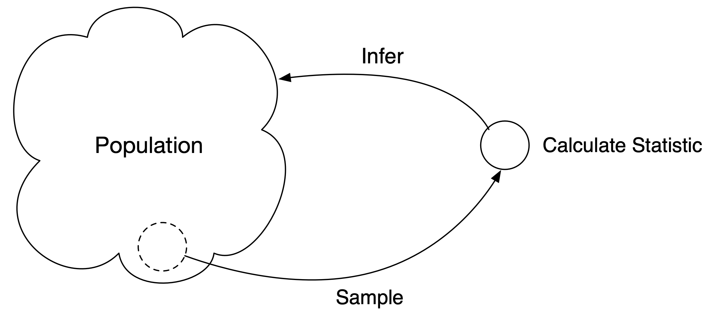

<style>
p{font-size:16px;}
h1{font-weight: bold;padding-top:0px;}
h2{color: #336699;padding-top:10px;}
h3{color: #666666;padding-top:25px;} <!-- FD7F20  2E8BC0 -->
h4{color: #FD7F20;padding-top:25px;}
ul{font-size:16px;}
ol{font-size:16px;}
</style>


```{r setup, include=FALSE}
knitr::opts_chunk$set(echo = TRUE)
```

---

**Statistics** is the scientific discipline that provides methods to help us make sense of data in order to make informated decisions.

---

## Goal of Statistics

The **goal** of statistics is to obtain information about one or more characteristics of a population.
In other words, **the objective is to make inferences about a population based on information contained in a sample**.

<div align="center">

</div>

The **inference** will be used for **decision-making**.


---


<!----------------------------------------------------------------------------->
## 1.1. Why Study Statistics?

To be an informed consumer of reports such as those described above, you must be able to do the following:

* Extract information from tables, charts, and graphs.
* Follow numerical arguments.
* Understand the basics of how data should be gathered, summarized, and analyzed to draw statistical conclusions.

> **Goal**: understand and use data to make decisions.  

- Decide whether existing data is adequate or whether additional information is required.
- If necessary, collect more information in a reasonable and thoughtful way.
- Summarize the available data in a useful and informative manner.
- Analyze the available data.
- Draw conclusions, make decisions, and assess the risk of an incorrect decision.

Statistical methods allow us to collect, describe, analyze and draw conclusions from data.


---


### On the role of computers in statistics

Statistical methods involve numerous, lengthy, and tedious numerical calculations. Modern statistics are done on computers (with statistical software packages).  Standard statistical software packages include: S, SAS, SPSS, Minitab, and R.  We use R.  R is a free and "open source" language, meaning the source code is viewable and alterable. As a result, it is highly extensible, with thousands of “packages” written by thousands of users, all of which are freely available.


<!----------------------------------------------------------------------------->
## 1.2. The Nature and Role of Variability

Understanding variability is the key to learning from data.


**Example**: In efforts to monitor water quality, a specialist selects five water
specimens each day.  The concentration of contaminants in parts per million (ppm)
is measured and recorded.  The _histogram_ below summarizes the average contamination
each day for 200 days.  


```{r}
load('../data/examples/1.2.rda')
hist(water, col = "#668899", xlab = "Average Contaimination", main = "Water Quality")
```


##### Consider
If there was a reported chemical spill from a industrial plant 1 mile away and 
the recorded average of the 5 samples was 15 ppm, would you interpret this as 
evidence that the water is affected by the spill?  What about 17 ppm? 22 ppm?


---


<!----------------------------------------------------------------------------->
## 1.3. Statistics and the Data Analysis Process
Statistics involves collecting, summarizing, and analyzing data.


The **data analysis process** can be organized into the following six steps:

1. **Understanding the nature of the problem**. Effective data analysis requires 
an understanding of the research problem. We must know the goal of the research 
and what questions we hope to answer. It is important to have a clear direction 
before gathering data to ensure that we will be able to answer the questions of 
interest using the data collected.

2. **Deciding what to measure and how to measure it**. The next step in the 
process is deciding what information is needed to answer the questions of interest. 
In some cases, the choice is obvious (for example, in a study of the relationship 
between the weight of a Division I football player and position played, you would 
need to collect data on player weight and position), but in other cases the choice 
of information is not as straightforward (for example, in a study of the relationship 
between preferred learning style and intelligence, how would you define learning 
style and measure it and what measure of intelligence would you use?). It is 
important to carefully define the variables to be studied and to develop appropriate 
methods for determining their values.

3. **Data collection**. The data collection step is crucial. The researcher must 
first decide whether an existing data source is adequate or whether new data must 
be collected. Even if a decision is made to use existing data, it is important to 
understand how the data were collected and for what purpose, so that any resulting 
limitations are also fully understood and judged to be acceptable. If new data are 
to be collected, a careful plan must be developed, because the type of analysis 
that is appropriate and the subsequent conclusions that can be drawn depend on 
how the data are collected.

4. **Data summarization and preliminary analysis**. After the data are collected, 
the next step usually involves a preliminary analysis that includes summarizing 
the data graphically and numerically. This initial analysis provides insight into 
important characteristics of the data and can provide guidance in selecting 
appropriate methods for further analysis.

5. **Formal data analysis**. The data analysis step requires the researcher to 
select and apply statistical methods. Much of this textbook is devoted to methods 
that can be used to carry out this step.

6. **Interpretation of results**. Several questions should be addressed in this 
final step. Some examples are: What can we learn from the data? What conclusions 
can be drawn from the analysis? and How can our results guide future research? 
The interpretation step often leads to the formulation of new research questions, 
which, in turn, leads back to the first step. In this way, good data analysis is 
often an iterative process.

---


<!----------------------------------------------------------------------------->
### Definitions

> The  **population** of interest is the entire collection of individuals or objects about which information is desired. 

> A **sample** is a subset of the population, selected for study.

> **Descriptive statistics** is the branch of statistics that includes methods for organizing and summarizing data. 

> **Inferential statistics** is the branch of statistics that involves generalizing from a sample to the population from which the sample was selected and assessing the reliability of such generalizations.

---


<!----------------------------------------------------------------------------->
### Evaluating a Research Study

The six data analysis steps can also be used as a guide for evaluating published research studies. 
The following questions should be addressed as part of a study evaluation:

1. What were the researchers trying to learn? What questions motivated their research?
2. Was relevant information collected? Were the right things measured?
3. Were the data collected in a sensible way?
4. Were the data summarized in an appropriate way?
5. Was an appropriate method of analysis used, given the type of data and how the data were collected?
6. Are the conclusions drawn by the researchers supported by the data analysis?


---


<!----------------------------------------------------------------------------->
## 1.4 Types of Data and Some Simple Graphical Displays

### Definitions

> A **univariate** data set consists of observations on a single characteristic.

> **Categorical (or qualitative)** is a univariate data set if the individual 
observations are categorical responses (e.g., favorite color: red, green, blue).

> **Numerical (or quantitative)** is a univariate data set if each observation 
is a number. Warning: often categorical data is represented by a number (e.g., 0 or 1).

> A numerical variable results in **discrete** data if the possible values of the 
variable correspond to isolated points on the number line.

> A numerical variable results in **continuous** data if the set of possible values 
forms an entire interval on the number line.


---


## R and RStudio

<!-- 
1. Download and Install (or use Cloud)
1. Navigate file system
2. Load data
  - lists
  - data frames
  - data files
3. Create plots
-->


#### Download and Install

Go to the [Comprehensive R Archive Network (CRAN)](https://cran.r-project.org) and follow instructions.


#### Access the File System

```{r}
# Get working directory
getwd()
```


```{r}
# Set working directory (replace string with your path)
setwd('/Users/ejames/Documents/MAT150/repo/lectures')
```


### Data


#### Vectors, Lists, and Arrays (oh my?)

To make a list of data, use `c`.  For example, to create [1,5,3,8,11],
```{r}
c(1,5,3,8,11)
```

and to make a list of names (stings)

```{r}
c("Alice", "Bob", "Charlie")
```

You can assign the lists to a name in order to refer to and access at a later time.  For example, it would be convenient to write, 

```{r}
Names = c("Alice", "Bob", "Charlie")
```

Now, we can get the second name in the list:

```{r}
Names[2]
```

To access the first and third (i.e., Alice and Charlie), we need to use the `c` operator inside.

```{r}
Names[c(1,3)]
```


#### Dataframe

The **dataframe** is the central object in R.  Think of it as a spreadsheet table.   It can contain data from one variable or many variables (just like a spreadsheet).  The data in a data frame is typically related in some fashion.  For example, it could be
data from players and points scored, or students and grades, etc.
<br><br>

To make a data frame:

```{r}
data.frame("Player" = c("Alice", "Bob", "Charlie"), 
           "Points" = c(30, 19, 22))
```
 
#### Data from File

Entering data by hand works in small cases, but for larger data sets it is imperative to read from a file.  

```{r}
# ../ means go up one directory.  
load("../data/examples/1.6.rda")
```

This next command will rename the third column to "Crimes"
```{r}
# rename column
names(df)[3] = "Crimes"
```


#### Data from a URL

We can read a file from a online data source.  For example, 

```{r}
X = read.table('https://raw.githubusercontent.com/jamesquinlan/Intro-Stats-MAT150/main/data/examples/ex4_3.txt', header = TRUE)
``` 
**NOTE**: The data has a header name so use `header = TRUE`.  


### Plots

#### Bar Chart (`barplot`)

Use with **categorical data**


**Example**

```{r echo=TRUE}
op = par(no.readonly = TRUE)
#change settings
par(mar=c(10, 4, 2, 2) + 0.75)
barplot(df$Crimes, 
        names.arg = df$University.College, 
        main="Crimes",    
        ylab="Freqency",  
        las=2, 
        cex.names = 0.8, 
        col= c("#3CA0D0")
        )
```
<!-- https://stackoverflow.com/questions/24511818/r-vertical-x-labels-out-of-plot -->

---


**Example**

```{r}
helmets = data.frame(Category = c("None", "Noncompliant", "Compliant"), Frequency = c(731,153,816))

barplot(helmets$Frequency, names.arg = helmets$Category, col = rainbow(3),
        xlab = "Category",
        ylab = "Frequency") 
```


#### Numerical Plots

Below is a plot showing the relationship between two numerical variables (enrollment and crime).  A standard question might be, "does high enrollment translate to more crimes?"
```{r}
plot(df$enrollment,df$Crimes, 
     xlab = "Enrollment", 
     ylab = "Crimes", 
     pch = 19, 
     col = 'blue')
```


#### Dotplots (`stripchart`)


**Use**: Small numerical data sets.

**Example** (Graduation Rates): Graduation rates for 61 NCAA Men's Division 1 
basketball teams that made it to the tournament along with graduation rates of all
athletes from the associated school were reported.  

```{r}
grad_rates = read.csv("../data/examples/ex_110.csv")
head(grad_rates)
```
```{r}
stripchart(grad_rates$BB,  pch = 21, col = "#336699", bg="lightgreen")
```


<!----------------------------------------------------------------------------->
## Exercises

##### 1.1 Give a brief definition of the terms *descriptive statistics* and *inferential statistics*.

**Answer**: See page 7.  

---


#####  1.2 Give a brief definition of the terms *population* and *sample*.  


---

#####  1.3 Travelocity survey showed that 40% of travelers check work e-mail while on vacation, 33% take cell phones on vacation in order to stay connected with work, and 25% bring laptop computers on vactation.  Are these percentages population values or sample values?

**Answer**: Sample


---


#####  1.5.  A university of 15000 students is interested in the proportion of students favor changing grade scheme.  Two hundred students are sampled.  What is the population of interest and what is the group of students that constitue the sample?

**Answer**: Population is all 15000 students and the sample consists of 200 of them.

---


#####  1.12 Classify the following as categorical or numerical. For those that are numerical, determine if they are discrete or continuous:

a. Number of students in a class of 35 who turn in a term paper before the due date. 

**Answer**: Numerical/discrete.

b. Gender of the next baby born at a particular hospital.

**Answer**: Categorical


c. Amount of fluid dispensed by a machine used to fill bottles with soda. 

**Answer**: Numerical/continuous


d. Thickness of the gelatin coating of a vitamin E capsule. 

**Answer**: Numerical and continuous.


e. Birth order classification of a math major. 

**Answer**: Categorical.

---


#####  1.13 Classify each of the following variables as categorical or numerical. For those that are numerical, determine if they are discrete or continuous.


a. brand of computer

**Answer**: Categorical


b. State of birth for someone in the US

**Answer**: Categorical


c. Price of a textbook

**Answer**: Numerical and continuous  


d. Concentration of a contaminant

**Answer**: Numerical and continuous


e. Zip Code

**Answer**: Categorical (ask if you can add two together)


f. Actual weight of coffee in a 1-pound can

**Answer**: Numerical and continuous.


---


#####  1.15 For the following numerical variables, state whether each is discrete or continuous.


a. The length of a 1 year old rattlesnake

**Answer**: continuous.


b. Altitude of a location in California selected randomly

**Answer**: Continuous


c. Distance from the left edge where a plastic ruler breaks: 

**Answer**: continuous (measurements such as weight, distance, length, temperature)


d. Price per gallon paid by the next customer to buy gas at a particular gas station

**Answer**: continuous


---


 


<!----------------------------------------------------------------------------->
### References

Peck, R., & Devore, J. L. (2011). *Statistics: The exploration & analysis of data*. Cengage Learning.


